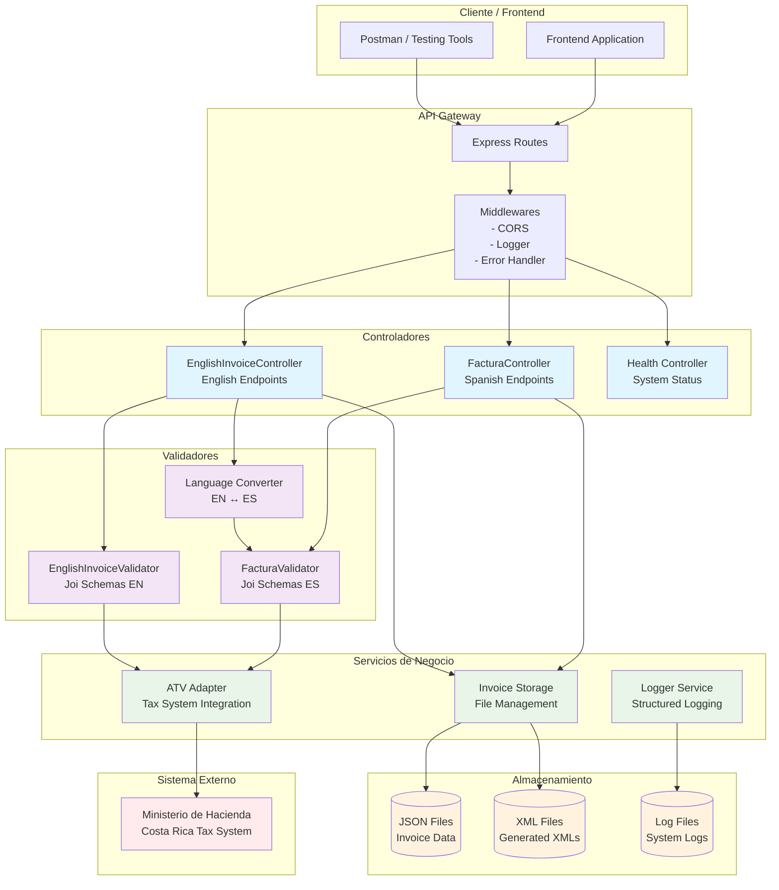
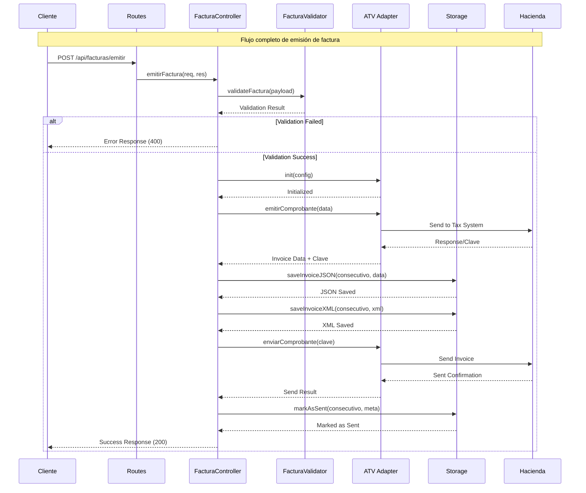
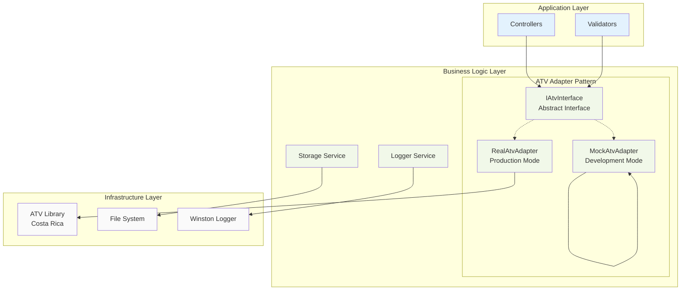
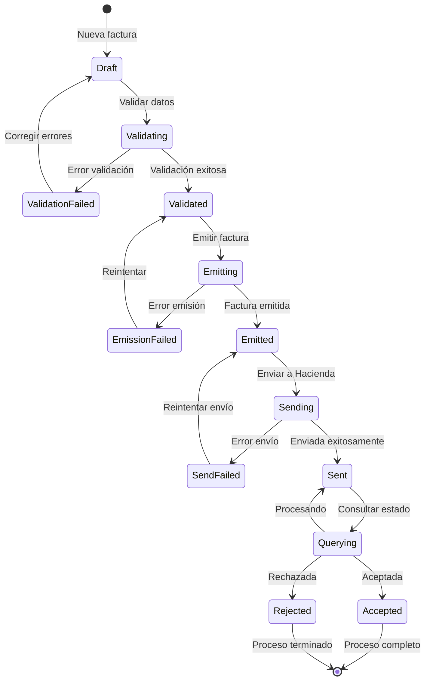
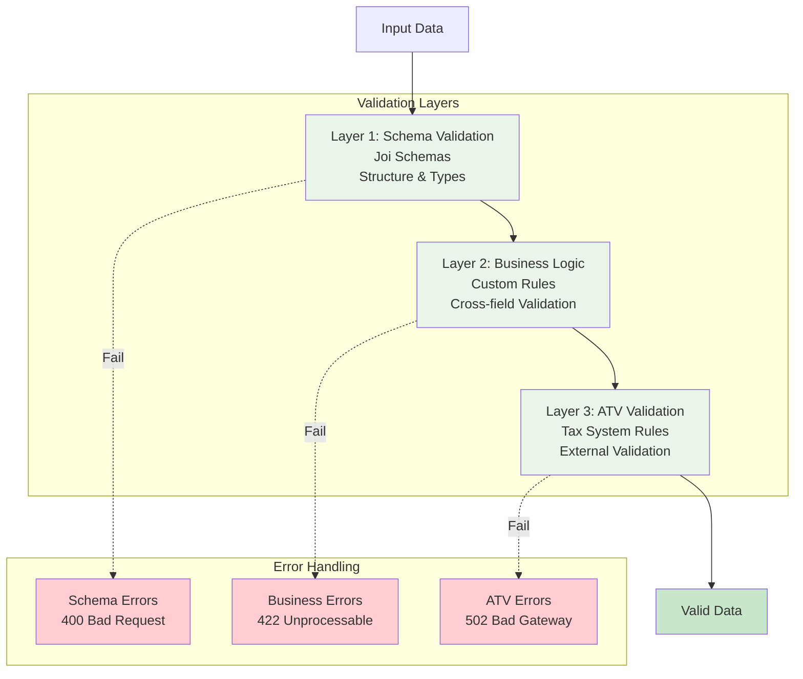
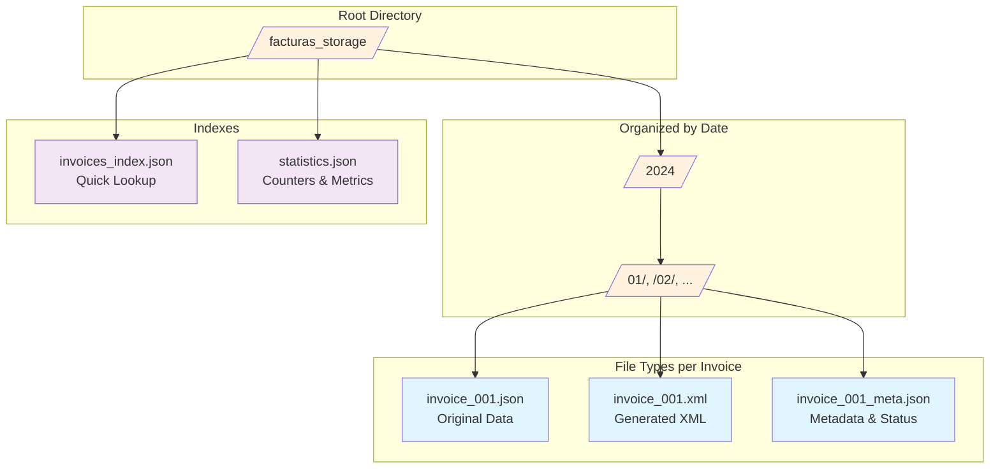
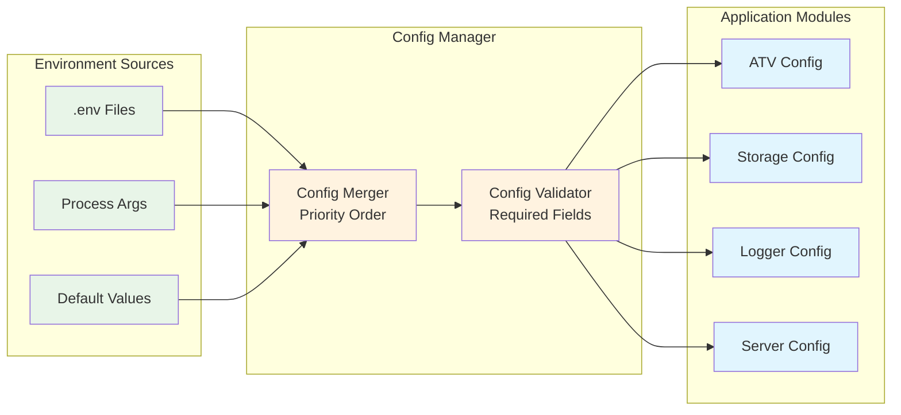
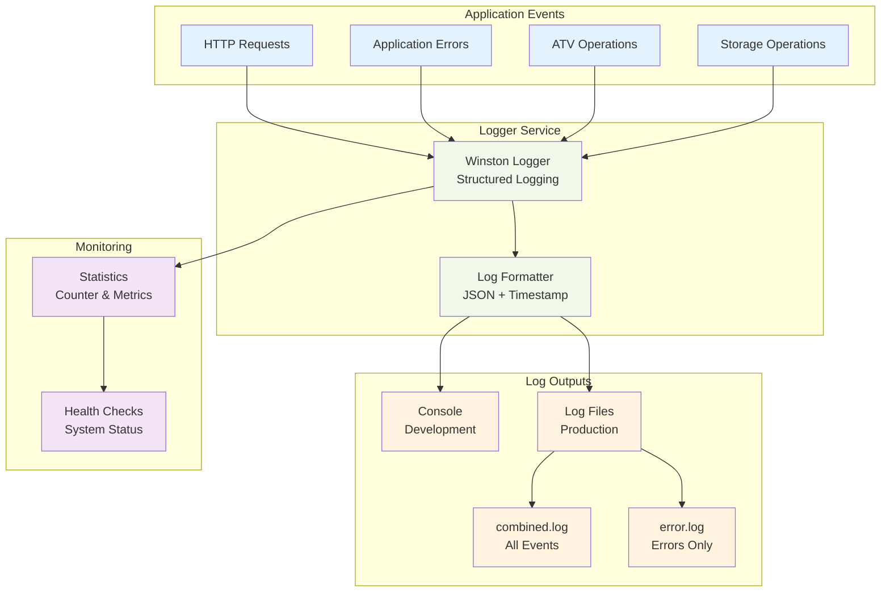

# Diagrama de Arquitectura - Hacienda API

## 🏗️ Vista General de la Arquitectura



## 🔄 Flujo de Procesamiento de Facturas



## 🌐 Arquitectura Bilingüe

```mermaid
graph LR
    subgraph "Spanish Interface"
        SPA[/api/facturas/*]
        SFC[FacturaController]
        SFV[FacturaValidator]
    end
    
    subgraph "English Interface"
        ENG[/api/en/invoices/*]
        EIC[EnglishInvoiceController]
        EIV[EnglishInvoiceValidator]
    end
    
    subgraph "Language Bridge"
        CONV[Language Converter<br/>convertToSpanish()<br/>convertFromSpanish()]
    end
    
    subgraph "Unified Backend"
        ATV[ATV Adapter]
        STORAGE[Storage Service]
        HACIENDA[(Tax System<br/>Spanish Only)]
    end
    
    SPA --> SFC
    SFC --> SFV
    
    ENG --> EIC
    EIC --> EIV
    EIC --> CONV
    CONV --> SFV
    
    SFV --> ATV
    SFC --> STORAGE
    EIC --> STORAGE
    
    ATV --> HACIENDA
    
    classDef spanish fill:#ffcdd2
    classDef english fill:#c8e6c9
    classDef bridge fill:#fff9c4
    classDef unified fill:#e1f5fe
    
    class SPA,SFC,SFV spanish
    class ENG,EIC,EIV english
    class CONV bridge
    class ATV,STORAGE,HACIENDA unified
```

## 🔧 Patrón de Adaptadores



## 📊 Gestión de Estados



## 🔐 Capas de Validación



## 📁 Estructura de Almacenamiento



## 🔄 Patrón de Configuración



## 📈 Flujo de Monitoreo



---

## 🎯 Puntos Clave de la Arquitectura

### **1. Separación por Idiomas**
- **Rutas separadas**: `/api/facturas/*` (ES) vs `/api/en/invoices/*` (EN)
- **Controladores independientes** pero compartiendo servicios de backend
- **Conversión automática** para compatibilidad con sistema fiscal

### **2. Patrón Adapter**
- **ATV Adapter** abstrae la complejidad del sistema fiscal costarricense
- **Modo REAL/SIMULATED** para desarrollo y producción
- **Interface consistente** independiente del backend

### **3. Validación en Capas**
- **Schema validation** (Joi) para estructura de datos
- **Business logic validation** para reglas de negocio
- **ATV validation** para validación fiscal externa

### **4. Storage Organizado**
- **Estructura temporal** para fácil navegación
- **Múltiples formatos** (JSON, XML, metadata)
- **Índices** para consultas rápidas

### **5. Logging Estructurado**
- **Winston** para logging profesional
- **Diferentes niveles** según ambiente
- **Metadata contextual** para debugging

### **6. Configuración Flexible**
- **Variables de entorno** para diferentes ambientes
- **Valores por defecto** para desarrollo rápido
- **Validación de configuración** requerida

Esta arquitectura soporta escalabilidad, mantenibilidad y testing efectivo del sistema de facturación electrónica.